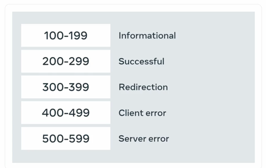

### http/s refresh

http methods/verbs

Get - retrieve
Post - create
put - update
patch - partially update
delete - delete

http requests

version type
url
method 
request headers - extra information from servers
ex: cookies, user-agents and referrers
http body - input data

http response

requested resource
content length
content type
headers
also, 
etags
content modified time
http status codes

### RESTfulness

It always should be 

* Client-Server based
* Stateless
* Cacheable

